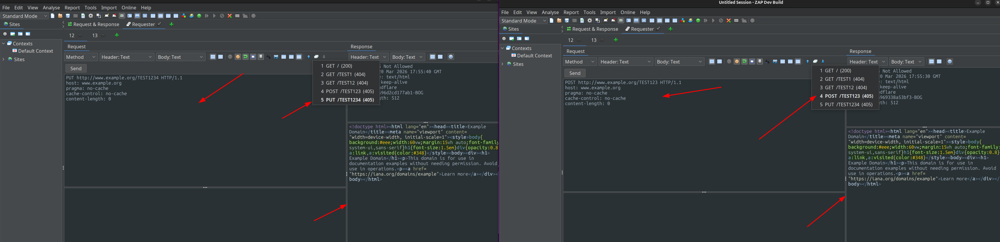
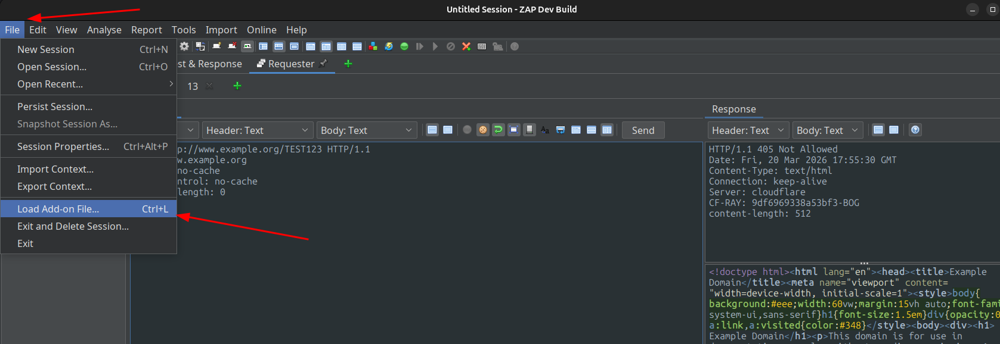

# IdRequests - Extensión para ZAPORXY

**IdRequests** es una extensión para [ZAPROXY](https://www.zaproxy.org/) que mejora el panel **Requester** añadiendo navegación interactiva del historial de peticiones y respuestas HTTP.

Esta extensión permite a los usuarios navegar de forma sencilla hacia atrás y hacia adelante a través de todas las peticiones enviadas anteriormente desde una pestaña específica. Cada vez que se navega en el historial, la extensión restaura tanto la petición HTTP original como su respuesta correspondiente directamente en la interfaz.

## ✨ Características Principales

* **Navegación Intuitiva:** La extensión inyecta automáticamente tres botones en la barra de herramientas de cada pestaña del *Requester* (justo al lado del botón *Send*):
    * `[←]` **(Atrás):** Carga la petición y respuesta anterior del historial de esa pestaña.
    * `[▼]` **(Lista Desplegable):** Abre un menú numerado que muestra todas las peticiones enviadas desde la pestaña actual (mostrando de forma resumida el método HTTP, la ruta y el código de estado). Al hacer clic en una entrada, la vista salta directamente a ese punto del historial.
    * `[→]` **(Adelante):** Carga la siguiente petición y respuesta del historial.
* **Historial Independiente por Pestaña:** Cada pestaña del panel *Requester* mantiene su propio estado y su lista de historial de forma aislada. Si abres una nueva pestaña, esta comenzará desde cero con un historial en blanco.
* **Inyección No Invasiva:** La extensión añade esta funcionalidad dinámicamente ("al vuelo") interceptando los eventos y la interfaz gráfica sin necesidad de modificar el código fuente original del *Requester*.

## 🛠️ Cómo Funciona

Internamente, la clase `RequesterHistoryInjector` detecta cuándo el usuario pulsa el botón *Send* y comprueba la base de datos de ZAP buscando nuevas entradas de tipo `TYPE_ZAP_USER`. Una vez identificada la nueva transacción, la añade al historial local de la pestaña.

Al navegar por el historial usando los controles inyectados, la extensión recupera la referencia histórica de la base de datos y la carga de nuevo en la interfaz de usuario de esa pestaña.

<video width="600" controls>
  <source src="IdRequests.mp4" type="video/mp4">
  Tu navegador no soporta video HTML5.
</video>

## ⚙️ Requisitos

* **ZAPROXY:** Versión **2.17.0** o superior (según lo definido en la configuración del manifiesto).
* La extensión oficial **Requester** debe estar instalada y habilitada en tu instancia de ZAP, ya que *IdRequests* depende de su panel de interfaz.

## 🚀 Instalación y Compilación

1. Clona el repositorio en tu máquina local.
2. Compila la extensión utilizando Gradle (el proyecto está configurado con Kotlin DSL):
   * https://www.zaproxy.org/docs/developer/
3. [idrequests-alpha-2.zap](https://github.com/Alejandr0ar/IdRequests/releases)
   
